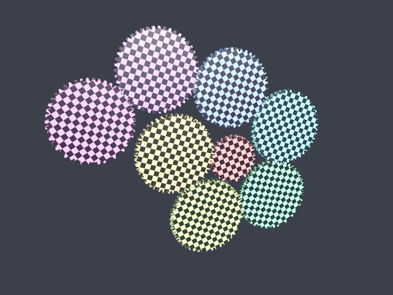

# vulkangears

A small [glxgears](https://en.wikipedia.org/wiki/Glxgears)-style demo written directly against
the **Vulkan** API in **C++11** (no C++14/17, no framework, no GLM).

It opens a resizable 800x600 window and draws a **train of 3 to 15 checker-textured
gears** that really mesh: a random count is drawn at startup, most stages are
idlers (the same tooth count, so the ratio is 1:1 and the only thing they change is
the direction of rotation) and a few mesh into a smaller or larger gear to step
the speed up or down. Every gear turns at a speed set by the tooth counts. The
console prints a full Vulkan report (API version, device, driver, memory heaps,
the app's own allocations) and a live FPS / frame-time / memory counter,
including the seed, so any train can be reproduced.



*(actual window capture, taken from the app's own window by the screenshot MCP
server - the console's device line names whichever GPU or software rasteriser
was in use)*

---

## Building

CMake is the build system; there is no Makefile.

```sh
cmake -S . -B build            # configure
cmake --build build -j         # build (add --config Release on multi-config generators)
ctest --test-dir build         # optional: the GPU-free geometry checks
./build/vulkangears            # run
```

### Linux without root

This machine has no system Vulkan/GLFW development packages, so
`scripts/fetch_deps.sh` vendors them first (Debian/Ubuntu, x86_64). It needs
**no root**: it downloads the `-dev` packages with `apt-get download` and unpacks
them into `third_party/sysroot`, which CMake then links against with an
`$ORIGIN`-relative rpath. Nothing is installed system-wide.

```sh
./scripts/fetch_deps.sh        # one-off; re-run any time to top the sysroot up
cmake -S . -B build && cmake --build build -j
```

If the sysroot is absent CMake falls back to the system Vulkan SDK and GLFW
(`find_package(glfw3)`, `vcpkg`, `conan`, or a system install); if GLFW cannot be
found at all it is downloaded and built automatically (`-DVKG_FETCH_GLFW=OFF`
disables that).

### Windows (Visual Studio)

Prerequisites:

1. **Vulkan SDK** from [vulkan.lunarg.com](https://vulkan.lunarg.com/) - gives
   `vulkan-1.lib`, the `vulkan/vulkan.h` headers and `glslangValidator.exe`.
   CMake finds it through the `VULKAN_SDK` environment variable.
2. **CMake 3.16+** and **Visual Studio 2019/2022** with the "Desktop development
   with C++" workload.
3. **GLFW** - either let CMake fetch it (`git` must be on `PATH`), or install it
   with `vcpkg install glfw3:x64-windows`.

```bat
cmake -S . -B build -G "Visual Studio 17 2022" -A x64
cmake --build build --config Release
build\Release\vulkangears.exe
```

For a MinGW/Ninja build the executable lands in `build\` instead of
`build\Release\`. If GLFW comes from vcpkg as a DLL, CMake copies it next to the
executable for you; `vulkan-1.dll` is already installed by your GPU driver.
`--headless` works on Windows too, which is a quick way to smoke-test the
renderer without a visible window.

In-source builds (`cmake .`) are refused by CMakeLists.txt, so always pass `-B`.

### Requirements

A C++11 compiler, CMake 3.16+, and either the Vulkan SDK + GLFW or the vendored
sysroot. No Python is needed: the SPIR-V is embedded by `cmake/EmbedSpirv.cmake`.

The sources are C++11. MSVC has no "C++11 mode" switch - it compiles this subset
in its default mode - so no standard flag is passed for MSVC, while GCC/Clang get
`-std=c++11`.

## Command line

```
window
  --width N            window width in pixels (default 800)
  --height N           window height in pixels (default 600)
  --vsync              force FIFO presentation (default is uncapped MAILBOX)
  --novsync            prefer an uncapped present mode (default)
  --frames N           stop after N frames (default: run until the window closes)

rendering
  --samples N          MSAA sample count, 1 disables it (default 4)
  --speed F            angular speed of the first gear in rad/s (default 1.15)
  --checker-scale N    integer checker frequency multiplier (default 1)
  --no-cull            disable backface culling
  --no-validation      do not enable the Khronos validation layer
  --verbose            also print informational messages from Vulkan layers

the gear train
  --gears N            number of gears, 3 to 15 (default: random)
  --seed N             random seed (default: the clock; the seed used is
                       printed, so any run can be reproduced with --seed)

device selection
  --gpu N              use physical device N (see --list-devices)
  --gpu-name TEXT      pick the first device whose name contains TEXT
  --list-devices       print every Vulkan device and exit

headless / offscreen
  --headless           render offscreen (no window) and write a PPM file
  --out FILE           output file for --headless (default vulkangears.ppm)

misc
  --fps-interval MS    console status line period (default 1000)
  --help               show this help
```

Useful invocations:

```sh
./vulkangears --frames 600 --fps-interval 500      # short benchmark, still prints diagnostics
./vulkangears --samples 1                          # MSAA off (much faster on a software rasteriser)
./vulkangears --gears 5                            # exactly five gears
./vulkangears --seed 1234                          # reproduce a particular train
./vulkangears --headless --out gears.ppm           # offscreen render, no display needed
./vulkangears --list-devices                       # what Vulkan devices exist
```

Press `ESC` or close the window to quit; on exit a session summary is printed.

## What the console shows

```
================================================================
 vulkangears - a train of meshing, checker-textured spinning gears
================================================================
 Vulkan loader       : 1.3.275   (instance API 1.1.0, 2 device(s) present)
 Instance layers     : VK_LAYER_KHRONOS_validation
 Instance extensions : VK_EXT_debug_utils
 Device [0]          : AMD Radeon R5 Graphics (RADV STONEY)
   API version       : 1.4.318
   driver            : radv (Mesa 25.2.8-0ubuntu0.24.04.2) conformance 1.4.0
   vendor / device   : AMD (0x1002) / 0x98e4
   type              : integrated GPU
   driver version    : 25.2.8 (raw 0x06402008)
   queue families    : graphics 0 (shared), present 0 (shared)
 Device extensions   : VK_EXT_memory_budget VK_KHR_driver_properties
 Target              : window 800x600
 Colour format       : B8G8R8A8_SRGB (SRGB_NONLINEAR)
 Present mode        : MAILBOX (no vsync, no tearing), 4 swapchain images, transform 1
 Depth format        : D32_SFLOAT
 Multisampling       : 4x (MSAA, resolved before present)
 Backface culling    : on
 Checker texture     : 256x256, 8x8 cells, 9 mip levels, anisotropic + trilinear filtering
 Gear train          : 30-30-30-30-30-21-21-31-31-46, module 1.00 (count chosen at random)
 Train seed          : 1234  (--seed 1234 reproduces this train)
 Train shape         : 6 idler stage(s), 1 step-up, 2 step-down
 Stage ratios        : 1.00(idler) 1.00(idler) 1.00(idler) 1.00(idler) 1.43 1.00(idler) 0.68 1.00(idler) 0.67
 Overall ratio       : 0.652 x  (last gear vs first, sign dropped)
 Speed range         : 0.750 .. 1.643 rad/s
 Mesh timing error   : 0.0000 % of a tooth pitch (worst of 9 joint(s))
 Geometry            : 15416 triangles, 24668 vertices, 10 draw calls per frame
 Memory heaps:
    heap 0  1.36 GiB   host           used 3.21 MiB / budget 1.12 GiB
      type 2  host-visible coherent
      type 5  host-visible coherent cached
      type 6  host-visible coherent cached
    heap 1  2.72 GiB   device-local   used 18.16 MiB / budget 2.25 GiB
      type 0  device-local
      type 1  device-local
      type 3  device-local host-visible coherent
      type 4  device-local host-visible coherent cached

 Application allocations:
    depth buffer                  7.32 MiB
    MSAA colour target            7.32 MiB
    gear vertex buffers    x10     1.13 MiB
    gear index buffers     x10    49.34 KiB
    checker texture               342.25 KiB
    texture staging buffer        341.33 KiB
    scene uniform buffers         224 B
    total                         16.56 MiB
 Uniform buffer      : 224 B (2 frames in flight, 112 B per frame)
================================================================

[info]  window is open - press ESC or close it to quit
[fps]   152.0 fps |   6.58 ms avg (min 5.11, max 9.42) | 610 frames | app 16.56 MiB in 25 allocations | heap1 18.16 MiB/2.25 GiB | 4.0 s
```

Those lines are what a 10-gear train actually reported; the run above is this
machine's integrated GPU rather than the software rasteriser the screenshot was
taken on, so the device lines differ while the structure does not.

The train lines are the ones worth reading. `Gear train` is the tooth counts in
driving order, so `30-30-30-30-30-21-21-31-31-46` is five 30-tooth gears, then a
21, a 31, a 31 and a 46. `Train shape` and `Stage ratios` say which of the nine
joints are idlers (`1.00`, the same tooth count) and which are steps, and
`Overall ratio` is the output speed relative to the input. `Train seed` quotes the
seed, so the exact arrangement in a screenshot can be reproduced.

The `[fps]` line is printed once per `--fps-interval` and carries the interval's
frames, average/min/max frame time, cumulative frame count, the application's own
device-memory footprint and the device-local heap usage/budget (the latter comes
from `VK_EXT_memory_budget` when the driver offers it). The window title is kept
in sync with the same numbers.

Validation-layer messages are streamed to the console as they happen, tagged
`[vk/validation]`, `[vk/general]` or `[vk/performance]`; the summary counts them.
`--verbose` adds the loader's informational chatter.

## Layout

```
CMakeLists.txt            the build system (Windows/Linux/macOS)
cmake/EmbedSpirv.cmake    turns .spv files into a C++ array (no runtime file I/O)
scripts/fetch_deps.sh     vendors the missing -dev packages without root (Linux)
shaders/gear.vert|frag    push constants, checker sampling, Blinn-Phong + rim light
src/main.cpp              argument parsing, GLFW window, main loop, signals
src/vk_gears.{h,cpp}      instance/device/swapchain/render pass/pipeline/frames
src/gear.{h,cpp}          gear profile, train kinematics, the train generator, checker texture
src/diag.{h,cpp}          logging, FPS counter, memory ledger, PPM output
src/platform.{h,cpp}      the only POSIX/Win32 specific code
src/math3d.h              minimal vec3/mat4 (column major, Vulkan clip space)
tests/mesh_check.cpp      geometry checks, run by `ctest`
```

Rendering basics: one graphics queue, two frames in flight, 4x MSAA resolved
straight into the swapchain image, a depth buffer, dynamic viewport/scissor,
one pipeline shared by every gear (per-gear data travels in a 96-byte push
constant: model matrix, tint, checker phase) and one procedurally generated
mipmapped checker texture. The SPIR-V is compiled at build time and embedded in
the executable, so the binary has no data files to find at runtime.

## The gears

The train is generated at startup from a seed: how many gears (3 to 15), how many
teeth each has, how they are arranged, and their colours and thicknesses. The seed
is printed, so any train can be reproduced with `--seed`.

* **Involute teeth.** A gear tooth is a 20 degree pressure-angle involute. This
  matters: with the naive straight-sided tooth the tips collide with the mating
  flank, which the geometry test demonstrates. The tooth is thinned to 0.48 of the
  circular pitch so there is a real backlash instead of theoretical contact.
* **Correct meshing.** Two external gears with the same module mesh when their
  centres are `pitchRadius1 + pitchRadius2` apart and

  ```
  teeth1 * angle1 + teeth2 * angle2 = constant
  ```

  which makes teeth pass the line of centres at the same instants. The start
  phases are solved from that relation (see `solveJointPhase`), so the gears are
  correctly timed rather than merely spinning near each other. The same relation
  fixes the speeds: `teeth * omega` is constant across a mesh.
* **Mostly idlers, with a few steps.** A mesh between two gears of *equal* tooth
  count is an idler: the ratio is exactly 1:1 and all it does is reverse the
  direction of rotation. That is what lets a train of a dozen gears turn at a
  watchable speed — the alternative, every stage multiplying the ratio, reaches
  tens of thousands to one and the far end is either frozen or strobing. So the
  generator draws mostly idlers and occasionally meshes into a smaller gear
  (speeding the next one up) or a larger one (slowing it down), steering back
  toward 1:1 whenever the running ratio nears 3:1 either way. A train of nothing
  but idlers is legal but shows nothing, so at least one step is guaranteed.
* **A chain, not a loop.** Each gear meshes with the next, and gears that are not
  neighbours never touch. That is deliberate: a closed loop of external gears is
  locked and could not turn at all — an odd property of gear trains that a demo
  could easily get wrong. It is also what the layout works to preserve: each new
  gear is placed by searching candidate directions and taking the one that keeps
  it clear of every gear it does not mesh with, preferring the most compact
  position. Maximising clearance instead would be the obvious rule and the wrong
  one, since the direction pointing away from the whole train always clears
  everything — the train would stretch into a straight line and the auto-framing
  would shrink the gears to fit it.

## Verification

```sh
ctest --test-dir build --output-on-failure
```

builds and runs a small geometry test (no GPU needed). For the fixed 30/14/22
triple it proves, over a full meshing cycle:

* the extruded profile is a closed, simple, star-shaped polygon whose rim
  normals point outward, and every triangle's winding agrees with its normals,
* the start phases satisfy the meshing equation (`~4e-5 %` of a tooth pitch) and
  the speeds keep `teeth * omega` constant,
* **neighbouring teeth never interpenetrate**, sampled 241 times per cycle,
  while staying engaged with ~6 % of a module of backlash,
* the outer gears really are clear of each other,
* the checker texture and its mip chain are well formed.

For the generated trains there are no expected numbers to compare against — that
is the point of them varying — so they are checked by property instead, over 65
trains: every gear count from 3 to 15 against five seeds. Whatever comes out of
the generator has to be a train that meshes:

* one module throughout, every tooth count inside 8..48,
* each joint's centres exactly a pitch-sum apart, and its timing equation
  satisfied,
* neighbours counter-rotating, and `teeth * omega` conserved across every joint,
* an idler turning at exactly its neighbour's speed, and a step actually stepping
  in the right direction (into a smaller gear must speed up, never slow down),
* **gears that do not mesh with each other not overlapping**,
* every gear turning, the overall ratio inside the intended band, and at least one
  step present.

It also pins down the generator itself: the same seed must reproduce the same
tooth counts, phases and layout, different seeds must not all collapse onto one
train, an unspecified count must stay in range and an out-of-range one must be
clamped.

The renderer itself is checked by running with the Khronos validation layer
enabled (it is vendored by `fetch_deps.sh` and picked up automatically), and by
comparing a backface-culled render against an unculled one - they must be
identical, which catches inverted winding. `--headless` makes all of that
possible on a machine with no display.

## Notes

* Portable C++11 + Vulkan. Linux/X11 and Wayland via GLFW; Windows via the
  Win32 backend the same GLFW build provides. Only `src/platform.cpp` differs
  between platforms (executable path, `setenv` vs `SetEnvironmentVariableA`,
  terminal detection).
* The vendored-sysroot route (`scripts/fetch_deps.sh`) is Debian/Ubuntu x86_64
  only; everywhere else CMake uses the Vulkan SDK and GLFW from vcpkg, a system
  install or an automatic fetch.
* The Windows code paths are written against documented Win32 APIs but have not
  been compiled on Windows from this machine - if MSVC or the SDK layout
  complains, the fixes should be small and local to `src/platform.cpp` and the
  dependency discovery in `CMakeLists.txt`.
* Default MSAA is 4x. On a software rasteriser (llvmpipe/lavapipe) that costs a
  lot - this container renders around 7 fps at 800x600; pass `--samples 1` there.
  On any real GPU it is far above the display refresh rate.
* The demo picks a discrete GPU if one is present; use `--gpu` / `--gpu-name` /
  `--list-devices` to choose explicitly.
